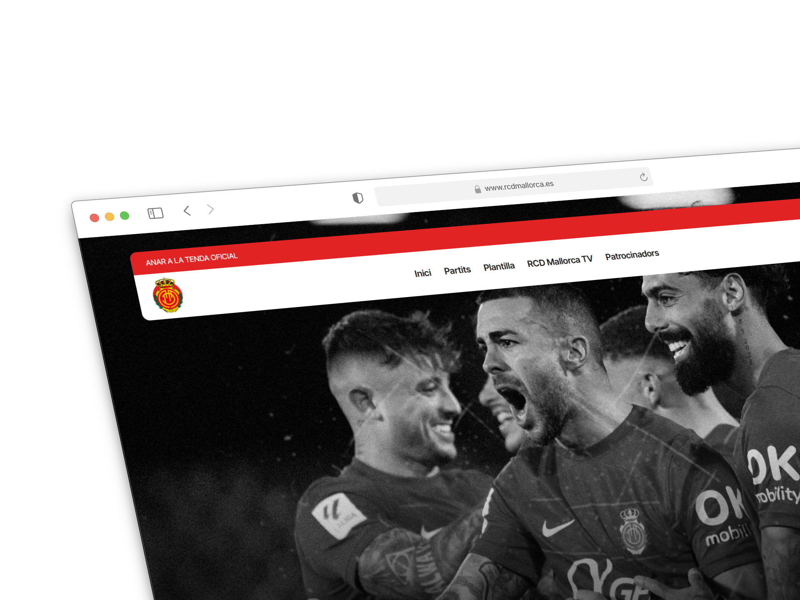

<div align="center">
    <br/>
    <p>
        
        <h1>RCD Mallorca</h1>
    </p>
    <p>
        <b>Rediseño de la página web oficial del RCD Mallorca</b>
        <br>
        Proyecto final - GS Desarrollo de Aplicaciones Multiplataforma
        <br>
        Irene Fontcuberta León · Jaume Llinàs Sansó · Daniel Cobo Palao · Adrià Garí Sagrera
    </p>
</div>

---

## Índice

1. [Descripción general](#descripción-general)
2. [Estructura del proyecto](#estructura-del-proyecto)
3. [Requisitos](#requisitos)
4. [Organización del equipo](#organización-del-equipo)
5. [Despliegue en local](#despliegue-en-local)
6. [Base de datos](#base-de-datos)
7. [Acceso al backoffice](#acceso-al-backoffice)
8. [Tienda del club](#tienda-del-club)

---

## Descripción general

> [!NOTE]
> Este proyecto está desarrollado con el framework **Flask**, utilizando **Python**, **HTML** y **CSS**.

La web del **RCD Mallorca** es una aplicación informativa sobre el club, con secciones dinámicas como vídeos, plantilla de jugadores y un backoffice de administración (zona privada) para gestionar el contenido.

- El **frontend** se encuentra en el directorio `/templates`, con los estilos en `/static`.
- Toda la lógica está centralizada en el archivo `app.py`.

> [!IMPORTANT]
> Es necesario configurar el archivo `.env` con la URL de conexión a Supabase antes de ejecutar el proyecto. En la versión entregable, dicho secreto ya está incluido.

---

## Estructura del proyecto
```
tongoliki/
├── static/
│   ├── img/
│   │   ├── index/
│   │   │   ├── header.jpg
│   │   │   ├── header.png
│   │   │   ├── header2.png
│   │   │   ├── header3.jpg
│   │   │   ├── laliga.png
│   │   │   ├── sonmoix.jpg
│   │   │   └── videos.jpg
│   │   ├── login/
│   │   │   └── bg.jpg
│   │   ├── main/
│   │   │   ├── favicon.png
│   │   │   └── logo.png
│   │   ├── players/
│   │   │   ├── card/
│   │   │   │   ├── 1.jpg
│   │   │   │   ├── 10.jpg
│   │   │   │   ├── 11.jpg
│   │   │   │   ├── 12.jpg
│   │   │   │   ├── 13.jpg
│   │   │   │   ├── 14.jpg
│   │   │   │   ├── 16.jpg
│   │   │   │   ├── 17.jpg
│   │   │   │   ├── 18.jpg
│   │   │   │   ├── 2.jpg
│   │   │   │   ├── 20.jpg
│   │   │   │   ├── 21.jpg
│   │   │   │   ├── 22.jpg
│   │   │   │   ├── 23.jpg
│   │   │   │   ├── 24.jpg
│   │   │   │   ├── 25.jpg
│   │   │   │   ├── 27.jpg
│   │   │   │   ├── 3.jpg
│   │   │   │   ├── 32.jpg
│   │   │   │   ├── 5.jpg
│   │   │   │   ├── 6.jpg
│   │   │   │   ├── 7.jpg
│   │   │   │   ├── 8.jpg
│   │   │   │   └── 9.jpg
│   │   │   ├── page/
│   │   │       ├── 1.jpg
│   │   │       ├── 10.jpg
│   │   │       ├── 11.jpg
│   │   │       ├── 12.jpg
│   │   │       ├── 13.jpg
│   │   │       ├── 14.jpg
│   │   │       ├── 16.jpg
│   │   │       ├── 17.jpg
│   │   │       ├── 18.jpg
│   │   │       ├── 2.jpg
│   │   │       ├── 20.jpg
│   │   │       ├── 21.jpg
│   │   │       ├── 22.jpg
│   │   │       ├── 23.jpg
│   │   │       ├── 24.jpg
│   │   │       ├── 25.jpg
│   │   │       ├── 27.jpg
│   │   │       ├── 3.jpg
│   │   │       ├── 5.jpg
│   │   │       ├── 6.jpg
│   │   │       ├── 7.jpg
│   │   │       ├── 8.jpg
│   │   │       └── 9.jpg
│   │   ├── sponsors/
│   │   │   ├── 1.png
│   │   │   ├── 10.png
│   │   │   ├── 11.png
│   │   │   ├── 12.png
│   │   │   ├── 13.png
│   │   │   ├── 14.png
│   │   │   ├── 15.png
│   │   │   ├── 2.png
│   │   │   ├── 3.png
│   │   │   ├── 4.png
│   │   │   ├── 5.png
│   │   │   ├── 6.png
│   │   │   ├── 7.png
│   │   │   ├── 8.png
│   │   │   └── 9.png
│   │   ├── teams/
│   │   │   ├── BET.png
│   │   │   ├── CEL.png
│   │   │   ├── FCB.png
│   │   │   ├── GIR.png
│   │   │   ├── LEG.png
│   │   │   ├── MLL.png
│   │   │   ├── OSA.png
│   │   │   ├── RAY.png
│   │   │   └── REA.png
│   │   ├── tenda/
│   │   │   ├── UML/
│   │   │   │   ├── carrito.jpg
│   │   │   │   ├── clases.jpg
│   │   │   │   ├── login.jpg
│   │   │   │   ├── producto.jpg
│   │   │   │   └── registro.jpg
│   │   │   ├── products/
│   │   │   │   ├── 1.webp
│   │   │   │   ├── 2.webp
│   │   │   │   ├── 3.webp
│   │   │   │   ├── 4.webp
│   │   │   │   ├── 5.webp
│   │   │   │   ├── 6.webp
│   │   │   │   ├── 7.webp
│   │   │   │   └── 8.webp
│   │   │   ├── static/
│   │   │       ├── header.jpg
│   │   │       └── tendes.webp
│   │   └── mockup.png
│   ├── styles/
│       ├── admin.css
│       ├── forms.css
│       └── style.css
├── templates/
│   ├── admin/
│   │   └── admin_panel.html
│   ├── auth/
│   │   ├── choice.html
│   │   └── login.html
│   ├── components/
│   │   ├── base.html
│   │   ├── forms.html
│   │   └── navbar.html
│   ├── players/
│   │   ├── datos_jugador.html
│   │   └── plantilla.html
│   ├── tienda/
│   │   ├── auth/
│   │   │   └── tienda_register.html
│   │   ├── formularios_back/
│   │   │   ├── add_producto.html
│   │   │   └── editar_producto.html
│   │   ├── plantillas_back/
│   │   │   └── admin.html
│   │   ├── carrito.html
│   │   ├── index.html
│   │   ├── producte.html
│   │   └── productes.html
│   ├── index.html
│   └── plantilla.html
├── app.py
├── readme.md
├── requirements.txt
└── vercel.json
```

---

## Requisitos

- Python 3.10+
- pip
- Entorno virtual (recomendado)
- Cuenta y proyecto activo en **Supabase**

**Dependencias principales (`requirements.txt`):**

- flask
- python-dotenv
- supabase

---

## Organización del equipo

El equipo se ha dividido en dos departamentos:

### · Frontend
**Integrantes:** Jaume Llinàs e Irene Fontcuberta

- Diseño visual del sitio web
- Creación y maquetación de páginas HTML
- Desarrollo de estilos CSS con estética coherente al tema del RCD Mallorca
- Estructuración del contenido para una buena experiencia de usuario

### · Backend
**Integrantes:** Daniel Cobo y Adrià Garí

- Implementación de la lógica de la aplicación con Flask
- Gestión de rutas y sesiones
- Conexión con la base de datos Supabase
- Buenas prácticas de programación y legibilidad del código

---

## Despliegue en local

### 1. Clonar el repositorio
```bash
git clone <url-del-repositorio>
cd rcd-mallorca
```

### 2. Crear y activar el entorno virtual
```bash
python -m venv venv

# En macOS/Linux:
source venv/bin/activate

# En Windows:
venv\Scripts\activate
```

### 3. Instalar dependencias
```bash
pip install -r requirements.txt
```

### 4. Configurar el archivo `.env`

Crea un archivo `.env` en la raíz del proyecto con el siguiente contenido:
```env
SUPABASE_URL=https://<tu-proyecto>.supabase.co
SUPABASE_KEY=<tu-clave-secreta>
```

> [!IMPORTANT]
> En la versión entregable, este archivo ya está incluido y configurado. No es necesario crearlo manualmente.

### 5. Ejecutar el servidor
```bash
flask run
```

O bien, desde **Visual Studio Code**, abriendo `app.py` y dándole al play.

> [!TIP]
> Si Flask no reconoce la aplicación, asegúrate de tener configurada la variable de entorno:
> ```bash
> export FLASK_APP=app.py   # macOS/Linux
> set FLASK_APP=app.py      # Windows
> ```

La aplicación estará disponible en `http://127.0.0.1:5000`.

---

## Base de datos

La base de datos está alojada en la nube mediante **Supabase**, que proporciona gestión de tablas, autenticación y almacenamiento de datos de forma sencilla e integrada con Flask.

---

## Acceso al backoffice

| Campo | Valor |
|-------|-------|
| Correo | `tongoliki@gmail.com` |
| Contraseña | `12345` |

---

## Tienda del club

Este proyecto incluye un **subproyecto** que es una réplica de la tienda oficial del RCD Mallorca.

**Integrantes:** Adrià Garí · Jaume Llinàs · Irene Fontcuberta

El frontend de la tienda se encuentra en `/templates/tienda` y comparte los estilos del proyecto principal en `/static/styles`. La lógica de backend está integrada en el mismo `app.py`.

### Equipos

**· Frontend** — Jaume Llinàs e Irene Fontcuberta
- Diseño visual de la tienda, carrito y páginas de login/registro
- Maquetaciones y mockups
- Experiencia de usuario e imagen de marca

**· Backend** — Adrià Garí
- Clases, objetos y modelos de datos
- Lógica de la tienda y del carrito
- Funciones de login y registro
